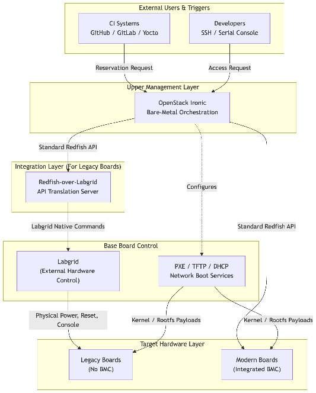
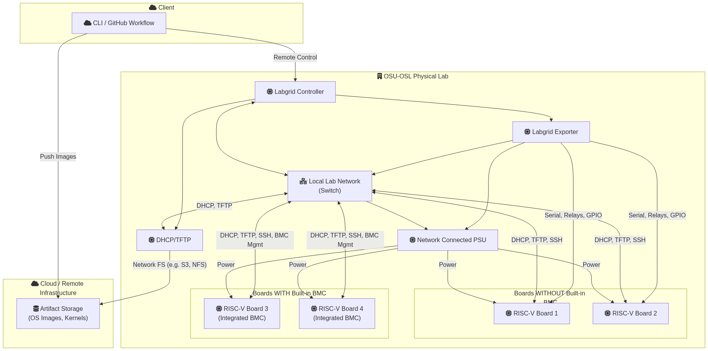
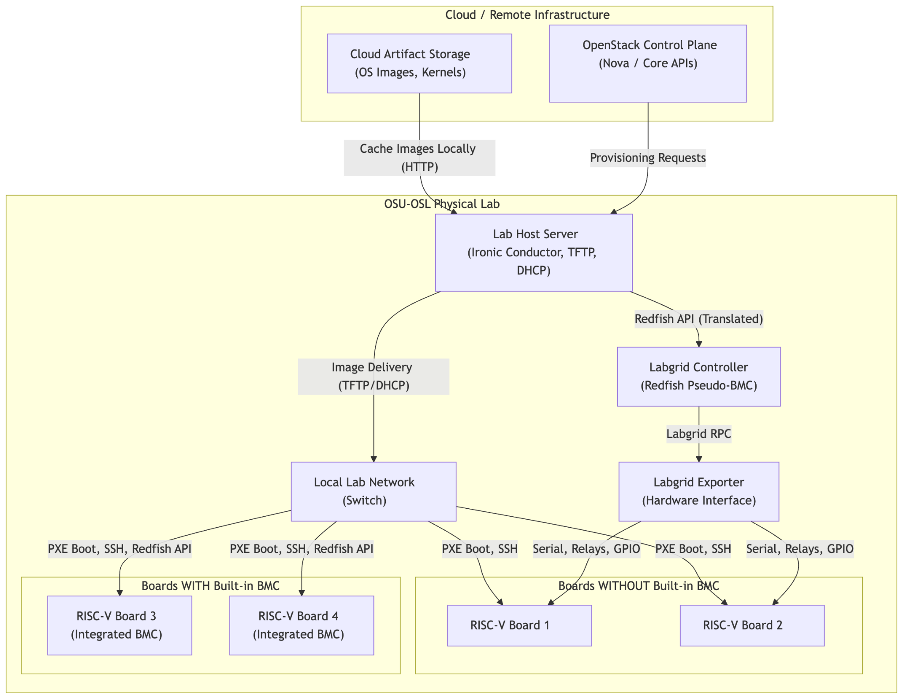

# RISE Board Farm: Project Proposal for Board Farm Management SW

**Status:** Draft | **Authors:** [puneetha@google.com](mailto:puneetha@google.com), [Ludovic Henry](mailto:ludovic.henry@qti.qualcomm.com)

# Names and ssh public keys of the project leads

*Ideally 2-3 people, to provide backup in the event of vacation time*
Tech leads:
- [puneetha@google.com](mailto:puneetha@google.com)
- [Ludovic Henry](mailto:luhenry@qti.qualcomm.com)
- [redbeard@redhat.com](mailto:redbeard@redhat.com)
- [lance@osuosl.org](mailto:lance@osuosl.org)

Contractors:
TBD

# Brief description

This project develops the management software stack for the RISE board farm hosted at OSU-OSL. This software must be developed in a way that other members of the RVI Labs Ecosystem Partners WG can use it as well.

The work is structured in two macro phases.

**Macro Phase 1** delivers a Labgrid-only setup. The goal is to get boards accessible quickly to a small group of trusted contributors - no OpenStack, no Redfish, no Ironic. Authentication is minimal and intentionally so: this phase is about validating the physical setup, getting people onto hardware, and learning what we actually need before committing to a production architecture. It is not intended for widespread use.

**Macro Phase 2** turns this into a scalable, multi-tenant service. Two paths are under consideration: (A) building OpenStack Ironic on top of the Labgrid layer via a Redfish-over-Labgrid translation service, or (B) replacing Redfish-over-Labgrid+Labgrid with OpenBMC. The right path depends on a technical feasibility assessment at the start of Macro Phase 2; both options may prove applicable independently or complementarily depending on the hardware in the farm.

In both phases, the board farm must support three primary usage models:

- **Long-running CI instances:** Managing automated workloads for GitHub, Yocto, GitLab, and other CI integrations.
- **Kernel testing:** Booting custom kernel images and root filesystems via TFTP/netboot/PXE, with full serial console access.
- **SSH access:** Providing direct user-space access to specific hardware for selected contributors.

# RISE workgroup(s)

Developer Infrastructure

# Existing resources

The technical path leverages well-understood tooling and aligns with current RISC-V platform specifications:

- **Labgrid:** [@tgamblin@baylibre.com](mailto:tgamblin@baylibre.com) has an existing Labgrid-based setup for the RISE Yocto CI work, and has shared the source code at [https://github.com/threexc/boardgarden](https://github.com/threexc/boardgarden), we can ask him to share more documentation. [Ludovic Henry](mailto:luhenry@qti.qualcomm.com) has also played with Labgrid for Spacemit K3 at [luhenry/board-farm-playground](https://github.com/luhenry/board-farm-playground). As an embedded board control library, Labgrid robustly handles physical testing, serial, reset, and power. It is the foundation for Macro Phase 1 and a candidate for Macro Phase 2.
- **OpenBMC:** An open-source BMC firmware and software stack with native Redfish API support. Some RISC-V boards may support or could be made to support OpenBMC, which would eliminate the need for a translation layer. Technical feasibility on the target boards is TBD and will be assessed at the start of Macro Phase 2.
- **Redfish-over-Labgrid:** Ironic natively requires Redfish or IPMI APIs for out-of-band power and boot control. A Redfish-over-Labgrid translation layer is one Macro Phase 2 path to bridge physical boards with OpenStack Ironic, if OpenBMC proves infeasible.
- **Boot Flows & Standards:** Ironic has a preference for network-boot, virtual media, and PXE/iPXE/GRUB2. The RISC-V Server Platform Specification and Boot and Runtime Services (BRS) explicitly aligns with this preference, but not all boards implement this specification so we cannot at the moment depend on it.
- **Image Deployment:** Whole-disk images are the preferred deployment path for Ironic bare-metal provisioning.
- **Hardware Profile:** We must be compatible with RV64G at a minimum. For future additions to the board farm, RVA23 mandates the Hypervisor (H) extension, ensuring the virtualization layer needed for OpenStack's Nova is present on compliant hardware; we could be having an explicit preference for hardware supporting that.

A Raspberry Pi or similar controller will serve as the initial board-farm controller.

# How will the output of this project be presented to the public?

The output will be presented through:

- Public git repository commits for the board-farm management stack.
- Comprehensive documentation detailing the provisioning, flashing, image management, testing, recovery, and user access workflows.
- Documentation mapping supported boards, OS images, boot methods, and operational procedures.

For **Macro Phase 2**, depending on the chosen path:

- Public implementation of the Redfish-over-Labgrid integration layer (path A).
- Upstream OpenStack Gerrit reviews if specific modifications are required in Ironic or Redfish handling (path A).
- Documentation of any OpenBMC enablement work on RISC-V boards (path B).

# System Overview

## Software stack

### Macro Phase 1 

### Macro Phase 2

[mermaid link](https://mermaid.live/edit#pako:eNqNVGtv2jAU_SuWpU2dBLRAeDSaKhVoB1qhCKj2yj64ySWJmtjMdqCs9L_vOg-WrFPVfMF2zrnn-N4TnqgrPKA2XUdi5wZMarIaOZzgo5J7X7JNQK4eNUjOIvLDocf1nQKpyHuykqHv49KhPzOaeYYThA4nZLlXGmL18V6eXnwK9Ti5J6cEFzfMLL4JV4sKzxRF5gi2EIkNVk2Zy-UY0UuQIeoOBVcigiMNuOfwfwzfbZA79WNtHKcbMmWc-RAD1-SG7UFWZCdS8NBF7O0G-FIz9yE_SuUHTEJ9ChrFb6UbgNKS6VDwVy2sJOMqSnHGxIRr8DNapk9OroUkN-Azd08GgklPfah4WoC3DlWA3HxVF1uQdeycL0MvNXY5n1R0sEPb0s3-Z2vAFGAHtRTpNM02Uyf5acVDLobAsuzJMQNjJO6wOwW5eoMZ6IEQGtnzr1c4wNX1ao4_o_FwntbB9zshH4gBpd5DF9TrTWXSB33Ft8Z7tvnr4eVYZ2IwHRrz5S5nV5gJgu-qfr-EOsgIU_wkJK8QigGCVyWWbGLe6_WLwwIwxNtsIgv4lWBeDnmcMpwJeYq8dPHC6iUog717RwbhOpFuKloM7Ro_0-x9hk4LYWS5Z4aYR4VgMg7F5o3o_PYZusppIAn116GfSFCHYrBlaFHK1M-zQmbYg63JRhyjIPLyFxmjQBnGPNir0MVAzcUOZI2YFupa8akfskGW5XIHKfkzjgoiDNYCT9aKzNk-EszolWhvI-Q9oDVqrFFbywRqNAYZM7OlT6aYQ3WAfyQOtXHpwZolkXaow5-RtmH8uxBxwZQi8QNqr1mkcJdsPBzlKGSYo_h4KjFBIIci4ZraVu88LULtJ_pI7X630er0LavTPOs3u81mv0b31O6eN7q9c6vdslrNdrvf7j7X6O9U9azRa3WsXrdpdXoWAtq95z94FOTH)

## Hardware setup

### Macro Phase 1

[mermaid link](https://mermaid.live/edit#pako:eNqlVmlv2zYY_isEB88NIDnWYdfRigKL0yTGktionBbYNAyURFtEJNKgqDqZ6_8-UpcNVT6G6oPN43nem-S7gQELMXRgp7MhlAgHbLoiwgnuOqAb4gXKYtHVQLH2BXGC_BincnMDuj4KXpacZTRU4F8W-dfdbredjsc9uojZOogQF2B-o-ZAfmnmLzlaRWAcE0zFJ_oN_OXBBXIWSA9iloXlhgf_rijqKxabyIcJuAR3RNxnPvjK-ItSuEfENFTDFtWS3apZ_V6CzzhhAoMJXXCUCp4FIuO4YZArGEdLXEsIkUA-SjH4nQuyQIGoEB98fvnx3dQFk0TOUg38gTnFcXpxhqFT9_mfqfuws9PPSBwSulQ7utqZRW8pCVAMHpDfsPAJC3dNRBDVbIrFWkZJXxOOQ_DASp5CqvXC0oJz0RAmYUtOwjGjgrM4xrwWmpCAsyAiqwoDdqB2IZ9eV4yLoyIqSEPAzf14ps9v57MWqtq7VHsNzsx9bkGXLitbKQ6EDIfENZj74zold7LcV4bKyDVDPEzB18n8fvo8B9cyNUInFFw_jhuC1JejjRZLPk_csf6l2AfGIaZ5imk2mGVJnfbFbPhyliPWKXOsopgmVGCpS8VXSrs4JM4-Jc4-R9wRl38oX6DrH5v1eKRUc3h9oE4BVSmdVF7X8nHoh4Oa68Uc892DSqIGiiPwvV3-_rjT2d0epUKwYBw8MarL6AI_r4kTvkq1LpZvQqzJWzNGb_J-u5tNpsqAouJ_km8esb46w0FxhgmjaeEAFj5jAvyqigQ8Iirv3UQ9KecFTwOue9_uwNks8_-wtMLOZSJqvvWTfHv_OamSzdYy5vuZRnHckuWdupZaltMybbm49jAdApnngKxzQPaBl1O6eSt7AIDkLZKmcvcb4Yyq5Ncu1ueiFFxV0a0L3uHesgdcSwNPt-6FUla-4RW36EIqi7I0Kh_1U9CyoShjr9A_HPSKV_0HMUrTG7wARPqQEtlzAbZCARFvTl8T-FXou2mCXvUIk2UkysmahCJy-r9BDSot0JFNDNZggnmC1BRulBIP5j2dBx05DBF_8aBHt5KzQvRPxpKKJl-JZQTl7RyncpatZKuDbwiSF3FSr3KZCMzHshUU0DEt28ilQGcDX6FjGFbPGtjWcNC3DHPQt0cafJOwod0b2VdD0zJH1nA0Gmw1-G-ut98bXlnDK3tgGVfG-8F7U4M4JDLAj0Wrmnes2_8AnA5SAQ)

### Macro Phase 2

[mermaid link](https://mermaid.live/edit#pako:eNqlVv9v2jgU_1csTxyrlLSQBDpyp0orrCtbO1DDdtJdTpNJXojVxEa2U9ox_vezCQREKfRu_iGK7fc-_jy_b57jiMeAfVyrzSmjykfzukohh7qP6jEkpMhU3ULl2jciKBlnIPXmHNXHJLqfCF6w2Ai_SZajvlgsarVQhCzJ-CxKiVBo1DNzpIcsxhNBpinqZryIP7AH9HeIE-InxI7MSrmOztAd5FwB6rNEEKlEEalCQIj_WQOZ0Rec0agCkCAeQKDBFFigNLXV_h9jcXbxtsuZEjxDw4wwONkBChQXZAIVUkwUGRMJ6L1QNCGRWkuUWIMA9XM9kxb6DIJBJrcBgcXm95nFg-Dr90FwszF4XNAspmxidmyzM0yfJI1Ihm7IeIfhF1DBjKoorbQZqBkX9_aMCojRDV_pGUmzXjItdXbN1WITQePVlWQgKtCcRoJHKZ2uZdBGqEQcSihibl_edl9A_fA45UIdxFyL7ABs_1e39lHH17RpLu2SExFL9Gd_dD34OkKX-vaUTRnSVHaAzFhKN_eQuOsHXftbuY-aL2k6xzSdHc2V14_b4uzY8ipD3GN03NI7faZAn6V0ROzxUAXnHYPzXgN3wORnEYZs--JniFfBaaKKQaQoZyH-uRs5B4LqIEyVI3sT5_8y2P6v1TY5ui4oCRfoC2cmI9B46dbj_APQdTSzdJHLyJOuIh-H_YGhUQbtL-o7B9ivrY8q62VpAKgx5wr9ZvyMbgnT1S0Hpg7d5OhqNLRQ77qrv0FwvZ__a5Wc_6BklSQnuarU3V9T916o3frGrnQTQ0QniZR694HqlmIupnJy2WNWJw0LmZ4NiywzyKuWsRZ87kn7An1q-r5PNaykuq2uUK7AcC87zB6gLXLvh33dKgciSkH3SGL8iYZEpfvZ3UGcUJkutd6OBGEyM6l9spUAm4Q9jtDTjSdSJ88yb60ZZUTKHiRoYx-fkoiqJ79hKXhU9maak0c7BTpJ1Woyo7FK_cbv2MKGF_b1EwAsnIPIiZniuTkkxMtnSYh9_RsTcR_ikC20zpSwvzjP12q67k5SrOtdJvWsmOr-Dj1KdGnLq1WhfQ-iq18zCvut88YSBPtz_Ih9x3NOXa_d6XRcp3nuuS0LP2Hf8047butdp9F22h2v_W5h4R_LQxun502nc95yXbfT6nheu2lhiKl242351lo-uRb_ArX8_oM)

#  Project roadmap

## Macro Phase 1: Labgrid-Only MVP

Goal: Get boards accessible to a small group of trusted contributors using Labgrid directly. No OpenStack, no Redfish, no Ironic. Authentication is minimal. This phase is not intended for widespread use.

### Phase 1: Requirements and Architecture

Define the setup for Labgrid-only board access.

Work items:

* Identify the initial supported boards.
* Document Trevor’s existing Labgrid-based setup.
* Detail workflows for the primary use cases in a Labgrid-only context: long-running CI workers, kernel testing via TFTP/netboot/PXE, and SSH access for selected contributors.
* Define a minimal board reservation mechanism (e.g., shared document, IRC channel, or lightweight locking script).
* Define required control operations: power, reset, serial console, and log capture.
* Delineate responsibilities: what Labgrid handles vs. what lightweight coordination tooling provides.

Resource requirements:

* Access to representative target boards.
* Access to Trevor’s Labgrid setup or equivalent documentation.
* Controller system, likely Raspberry Pi or similar.
* CPU, memory, and disk sizing: TBD.

### Phase 2: Labgrid Setup and Core Board Control

Stand up Labgrid and validate physical board control.

Work items:

* Set up the controller environment and deploy Labgrid.
* Onboard the initial set of boards into Labgrid.
* Validate power, reset, and serial console control.
* Validate boot and netboot where supported by the hardware.
* Validate serial console capture and log collection.
* Implement basic board state visibility and error reporting.

Resource requirements:

* Labgrid-managed board setup.
* Controller system.
* Network access between the controller, Labgrid, and the boards.
* CPU, memory, and disk sizing: TBD.

### Phase 3: Basic User Access and Workflows

Give the select group access to boards with minimal ceremony.

Work items:

* Implement board reservation using the lightweight mechanism defined in Phase 1.
* Provide SSH access to boards for authorized users.
* Provide serial console access (read-only or shared, to be decided).
* Support loading custom kernel images and root filesystems.
* Validate CI integration for at least one CI system (e.g., Yocto or GitHub Actions).
* Document the operator and user workflow for Macro Phase 1 users.

Resource requirements:

* Initial RISC-V boards.
* Board-farm controller.
* Storage for boot images and logs.
* No production-grade authentication is required in this phase.

## Macro Phase 2: Scalable Muti-Tenant Stack

Goal: Build a production-ready, multi-tenant service on top of the Macro Phase 1 foundation. Begin with a feasibility assessment to determine the architecture, then implement.

### Phase 4: Technical Feasibility Assessment

Determine the right architecture before committing to implementation.

Work items:

- Assess OpenBMC support on the target boards: firmware availability, porting effort, and Redfish compliance.
- Assess Redfish-over-Labgrid as the alternative: implementation scope, Ironic compatibility, and maintenance burden.
- Define selection criteria and make an architecture decision: OpenBMC-native, Redfish-over-Labgrid, or a hybrid where different boards take different paths.
- Produce an architecture sketch for the chosen path.

Resource requirements:

- Target boards for firmware and API testing.
- Engineering time for prototype spikes on both options.

### Phase 5: Architecture and Core Stack

Implement the chosen architecture.

Work items (path A - Redfish-over-Labgrid + OpenStack):

- Implement the Redfish API server exposing board-management operations via Labgrid.
- Map Ironic-facing Redfish operations (power state, reset, boot source) to Labgrid operations.
- Integrate OpenStack Ironic with the Redfish-over-Labgrid layer.
- Register boards as manageable bare-metal nodes in Ironic.

Work items (path B - OpenBMC):

- Enable or port OpenBMC firmware on target boards.
- Validate native Redfish API coverage for Ironic integration.
- Integrate OpenStack Ironic directly with OpenBMC.

Work items (common to both paths):

- Validate the full lifecycle: board reservation, deployment, test execution, access, and release.
- Validate automated recovery to a known-good state following failed flashes, boots, or kernel panics.
- Set up the OpenStack/Ironic control-plane host or VM.
- Implement secure multi-tenant access controls.
- Ensure reliable capture of console output, logs, and test results.
- Document the operator workflow.

Resource requirements:

- Initial RISC-V boards.
- Board-farm controller.
- OpenStack/Ironic control-plane host or VM.
- Storage for boot images, OS images, test images, root filesystems, logs, and results.
- CPU, memory, and disk sizing: TBD.

### Phase 6: OS Image Management

Develop the OS image-management workflow supporting modern RISC-V distributions.

Supported image set:

- **Ubuntu 24.04**
- **Ubuntu 26.04** (targeting RVA23 compliant hardware)
- **Debian 13**
- **Gentoo** (active 64-bit RISC-V support)
- **RHEL 10** (Developer Preview for RISC-V)

Work items:

- Define the deployment image formats.
- Support long-running installed images for CI workloads.
- Support loading custom kernel images (via TFTP/PXE/netboot) and custom root filesystems.
- Implement a flexible, low-friction workflow for authorized maintainers to add, update, and remove available OS images.
- Validate successful deployment, boot, access, and recovery across the supported distribution matrix.

Resource requirements:

- High-capacity storage for OS images, custom kernels, and root filesystems.
- Metadata storage.
- Role-based access control (RBAC) mechanism for image maintainers.
- Artifact retention policy: TBD.

### Phase 7: CI, Kernel Testing, and SSH Workflows

Turn the control stack into a production-ready service fulfilling the primary use cases.

Work items:

- Implement the integration points for external CI systems (GitHub, GitLab, Yocto) to request and hold boards.
- Implement the developer workflow for submitting custom kernels, boot images, and rootfs payloads.
- Expose secure, read-only serial console access to developers.
- Implement the SSH access provisioning and revocation system for authorized users.
- Enforce strict board sanitization, returning hardware to a pristine state post-reservation.

Resource requirements:

- Storage for user-submitted payloads, generated artifacts, logs, and test results.
- Authentication integration for CI systems and SSH users.
- Public or authenticated artifact access mechanism.

### Phase 8: Scaling and Operations

Prepare the board farm for multi-tenant, continuous operation.

Work items:

- Onboard additional hardware and board variants.
- Implement advanced scheduling, queuing, and quota management.
- Harden failure handling for stuck, unresponsive, or degraded boards.
- Implement automated health checks.
- Deploy operational dashboards and status pages.
- Finalize documentation for administrative procedures and runbooks.

Resource requirements:

- Additional controller and OpenStack control-plane capacity.
- Expanded storage.
- Google Cloud Platform (GCP) instance types: Prefer Ampere Altra instances where suitable and cost-effective.

# What Linux distribution (with version) is desired?

*Should be something natively supported by Google Cloud*

# What parts of this project would be considered “critical” vs “nice to have”?

### Critical

**Macro Phase 1:**

- Labgrid-based power, reset, serial console, and boot control for the initial boards.
- A lightweight board reservation mechanism.
- SSH access for the select group of authorized contributors.
- Serial console capture and basic log collection.
- Minimal documentation sufficient for the initial users.

**Macro Phase 2:**

- Board reservation, release, and automated sanitization workflows.
- Power, reset, and boot control via the chosen integration (Redfish-over-Labgrid or OpenBMC).
- OpenStack/Ironic integration leveraging the chosen architecture.
- Full UEFI/PXE/netboot support for kernel testing and custom root filesystems.
- Reliable serial console capture and user access.
- Image deployment supporting Ubuntu 24.04, Ubuntu 26.04 (RVA23), Debian 13, Gentoo, and RHEL 10.
- Low-friction image management for authorized maintainers.
- Long-running CI workload support.
- Secure SSH access for selected contributors.
- Comprehensive user and operator documentation.

### Nice to Have

- Publicly accessible operational dashboards and status pages.
- Upstream OpenStack modifications (if board-farm requirements exceed current Ironic Redfish implementations).
- Nova/VM validation, unless explicitly required to validate virtualization on RVA23 hardware within the farm.

# Can the build agents be preempted?

SLAs have to be established depending on the users (1st party vs 3rd party)

# Do the systems need to run 24x7, or can they be started and stopped based on load?

Macro Phase 1: The Labgrid controller and boards remain powered on, but there is no complex control plane to manage. Availability requirements are proportional to the small initial user group.

Macro Phase 2: Based on load, with the following constraints:

The core board-farm control plane must remain highly available. Long-running CI workloads and ad-hoc SSH access necessitate that allocated boards and their required management services operate 24x7 during reservations. Peripheral services, such as reporting or artifact processing, may be scaled on demand depending on the final architecture.

# Any other requirements?

- **Location:** Physical boards are hosted at OSU-OSL. The software should not be tied to that specific location, and must be usable in other labs/locations as well. Any dependency must be explicitly documented.
- **Tenancy:** The control plane must securely support concurrent, shared access by multiple users. Each board will only support a single-user at any given time.**Tenancy:** Macro Phase 1 supports a small trusted group with no hard isolation requirement. Macro Phase 2 must securely support concurrent, shared access by multiple users; each board will only support a single user at any given time.
- **Interfaces:** Direct Labgrid access is sufficient for Macro Phase 1. A Redfish interface (via Redfish-over-Labgrid or OpenBMC) is a hard requirement for Macro Phase 2 to bridge Ironic with the boards.
- **Storage:** Substantial artifact storage is required for base OS images, custom root filesystems, user kernels, logs, and test results. It’s not a requirement to host some of these artifacts on premise at OSU-OSL, some can be hosted elsewhere (github, s3, anywhere internet accessible)

## Questions

* How do we minimize flashing the boards as much as possible to extend lifetime, and see if everything in the stack supports netboot
* How does the flow “User requests boot machine A, Kernel B, and Distro C” goes through all layers of the stack (Ironic, Redfish, Labgrid, Board, PXE/TFTP/DHCP)
  * [labgrid-dhcp-tftp-research](https://docs.google.com/document/d/1LbcuiTuChLdNQybSkRU_bYCvshnjS4TsOXpcgW-5b2Y/edit?tab=t.0)
* How do we provide Network isolation to avoid users of lab devices cannot snoop on each others traffic
* How do we get the device config (mac address, device specs) of newly added devices and how do we manage these?
* What would be our recovery mechanism? A/B flashing or Known good build?
* What’s the plan for storing and retrieving device logs/operational logs etc?
* We should also outline identity and access management aspects
* Which boards in the initial set support or could support OpenBMC, and what is the effort to enable it?
